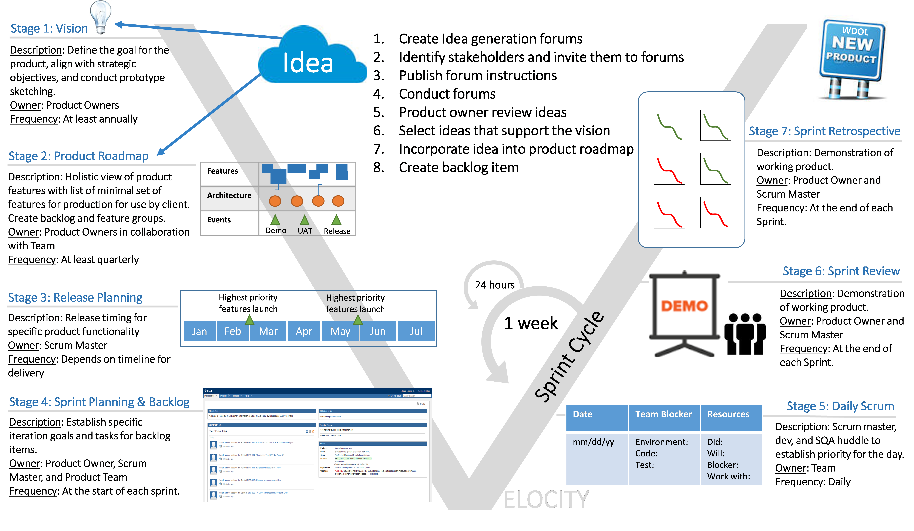
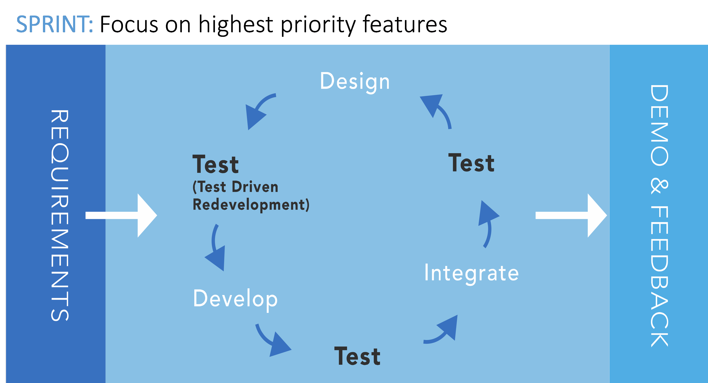

# Prototype

A publicly accessible prototype is hosted at
[http://18f-dari.techflow.com](http://18f-dari.techflow.com/).

# Documentation

* [Build/Install Instructions](installation.md)
* [Maven Site](http://tflowgit.github.io/tf-ads-bpa/1.0-SNAPSHOT/)
* [Swagger API Documents](http://18f-dari.techflow.com/swagger/)
* [Jenkins Job](http://18f-dari.techflow.com/jenkins/job/tf-ads-bpa-build/)
* [SonarQube Reports](http://18f-dari.techflow.com/sonarqube/dashboard/index/1)
* [Javadoc](http://tflowgit.github.io/tf-ads-bpa/1.0-SNAPSHOT/apidocs/index.html)

# Source Code

https://github.com/TFlowGit/tf-ads-bpa.git (branch=master)

# TechFlow's Agile Approach

TechFlow has been providing Agile delivery services to the Federal
Government for more than 3 years. In our Assisted Acquisition Services,
Business Systems contract, we currently employ 8 parallel scrum teams
doing a mix of development and maintenance. This experience has required
us to continually refine our approach to align with best practices, as
defined in the U.S. Digital Services Playbook. In broad terms, the
playbook addresses users, processes, technology and personnel.

The playbook begins with users, understanding what they need and how we
can satisfy their needs. At TechFlow, we have integrated business
analysts into our sprint teams to ensure that the needs of the customer
are directly addressed by the development teams.

Effective service delivery requires well defined, repeatable processes.
Our teams are well versed in the principles of agile and we have
developed supporting processes, beginning with our overall agile
approach and including items such as continuous integration, test on
build and application performance monitoring to further facilitate our
success.

Use of appropriate technology is an enabler for successful projects. We
have a history of implementing the best open source and COTS
technologies to facilitate our mission. This includes being the first
company to use ServiceNow and Puppet for GSA and is reflected in our
choice of technology stack including nginx, Docker and Spring Boot.

Finally, success requires the creation of a high quality team. Our team
begins with our assigned product manager or owner, an individual with
years of experience managing agile development teams and includes our
entire development team. The team employed in this effort is composed of
professionals who have been delivering products through an agile process
for the past three years.

Our work on this effort began with the assignment by TechFlow's Division
Manager of the product owner. For this Agile Delivery Services BPA
response, our product owner, Aristo Mitchell was given full
responsibility. (**point a** in the evaluation criteria list)

In addition the Product owner, our team included (**point b**):

-   Delivery manager
-   Technical architect
-   Usability tester
-   Visual designer
-   Content designer
-   Front end web developer
-   Back end web developer
-   DevOps engineer
-   Security engineer
-   Agile coach
-   Business analyst
-   Digital performance analyst

As the government evaluates the project artifacts contained in the
GitHub site, the sprint matrix file provides a cross reference showing
which labor category was responsible for the creation of each
artifact.

The TechFlow team shipped one MVP and one product increment as
described below. It utilized continuous integration and delivery
throughout the development period, as the government can evaluate
through Jenkins.

In developing our application, this team followed TechFlow's Agile
methodology, as illustrated in Figure 1. This methodology defines the
approach we used to deliver a working design and development prototype
using datasets from <https://open.fda.gov>. Specifically, we developed a
web application that consumes a publicly accessible Application
Programming Interface (API) and using GitHub.

Figure 1: TechFlow's Agile Methodology

**Stage 1: Vision.** The entire team had a working meeting on Wednesday
morning, 6/17 facilitated by the product owner to discuss the business
value and vision based on the FDA dataset. Once the team agreed, the
product owner created groups to focus on:

-   Evaluating FDA data sets to identify how they would be employed.
-   Creating user personas by interviewing 8 individuals, two
    Pharmaceutical representatives, two legal professionals and four
    prescription drugs users (**point c**). This same group also agreed
    to participate in UAT.
-   Defining the interaction with the application through the use of
    human centered design approaches, including rapid prototyping,
    usability testing and good design principles (**point d**).
-   Identifying an overall website style and assigned an individual to
    tailor existing style guide templates (**point e**)
-   Defined the base technical architecture. The architecture was
    modified as iterations were completed (**point g**). The vision for
    the product included:
    -   The platforms to be supported how to achieving multiplatform
        functionality (**point h**)
    -   The technology stack to enable the vision (**point i**)
    -   The use of Jenkins for Continuous Integration and Puppet for
        continuously deploying code (**point l**).
    -   The use of Git for configuration management (**point m**)
    -   The use of CloudCheckr for continuous monitoring (**point n**)
    -   The use of Docker containers (**point o**)
    -   The use of only openly licensed and free of charge technologies
        (**point q)**

After allowing for discussion, the product owner required the team to
draft user stories based on user personas and input from the dataset
evaluation. We addressed 9 user stories.

**Stage 2: Product Roadmap.** Also on Wednesday afternoon, the product
owner facilitated the product roadmap meeting. During this meeting, the
team:

-   Defined the Minimal Viable Product (MVP),
-   Formalized features to be developed and created the roadmap,
-   Formalized user stories and prioritized the backlog,
-   Setup the local and Amazon Web Services (AWS) environments (**point
    j**), and
-   Setup accounts on GitHub and created the team repository.

**Stage 3: Release Planning.** On Thursday morning, the entire team
conducted a release planning meeting where we agreed on:

-   Features that could be accomplished based on team's capacity.
-   A test driven development approach where the team first creates unit
    tests to validate the user stories and then develops application
    code (**point k**).
-   Delivering multiple releases to testing per day to test and validate
    feature development based on acceptance criteria.
-   The roadmap including two releases into production.
-   The "definition of done" that would be applied to each user story
    and to each sprint as a whole.

**Stage 4: Sprint Planning.** On the first Thursday and the following
Wednesday we conducted sprint planning meetings. Figure 2, depicts this
iterative process. During the sprint planning meeting the team:

-   Defined 2 sprints that would be conducted within the space of 8 days
-   Established the goals for each sprint
-   Updated the sprint backlog
-   Agreed on the Definition of Done
-   Selected 4 user stories for the MVP with an additional 5 user
    stories to be addressed with the next product increment. In addition
    there are still 8 user stories in the product backlog.
-   Created sprint backlog tasks.
-   Identified and resolved any issues with the development environment
    and its setup.
-   Updated the product roadmap, release plan and sprint backlog for the
    team by the agile coach/scrum master.

**Stage 5: Daily Scrum.** Starting on Friday 6/19 and continuing through
Monday 6/29 (with the exception of Wednesday 6/24 (which was reserved
for the sprint planning meeting), the scrum master conducted and chaired
daily scrums. This meeting was the primary communication mechanism for
the product development team to plan their day, assess sprint progress,
identify completed items, and discuss blockers. The scrum is where, as
illustrated in Figure 2, we plan each day's activities to design,
develop and integrate the product, while testing our work at each step
in the process. To ensure that our staff is working issues, not just
discussing them, we limit the daily scrum meeting to 15 minutes. The
scrum master is tasked with ensuring that the meetings are focused on
immediate priorities, impediments, and project coordination. Issues
beyond this limited scope are placed in the "Parking lot". These items
are handled in other project meetings, where attendance is limited to
only those individuals required to resolve the issue.

Figure 2: Iterative Approach

**Stage 6: Sprint Review.** We conducted two sprint review meetings
(6/24 and 6/29) facilitated by the product owner. The sprint review
demonstrates what was accomplished (user stories done) during the sprint
and receives feedback from the UAT group. We received concurrence from
the UAT group (**point f**) that the goals of the sprint were
accomplished and the acceptance criteria was met for each user story.
When each user story was demonstrated and accepted by the product owner,
the meeting concluded.

**Stage 7: Sprint Retrospective.** We conducted two sprint retrospectives
(also 6/24 and 6/29). Again, both of these meetings were facilitated by
the product owner. The goal for conducting the sprint retrospective is
to continually improve scrum team processes and performance (**point
g**). We asked the team the following questions:

-   Did we meet our expected results? We looked at the sprint burn-down
    to compare planned versus actual work accomplished.
-   Did the team have the right skill sets to deliver this solution? If
    not, what did we need?
-   Did we have good communication and collaboration?
-   Did we adhere to our process and meet the definition of done?
-   Do we need to use different tools?
-   How can we get more productivity in the next sprint?

At the end of the sprint review the software is deployed into
production. As part of our deployment process, we create and test
deployment instructions (**point p**).

# License

All code created for this project is licensed under the CC0
license. Please read [LICENSE.md](LICENSE.md) for details.

Please see [LICENSES.md](LICENSES.md) for a list of all software used
as a part of this project.
